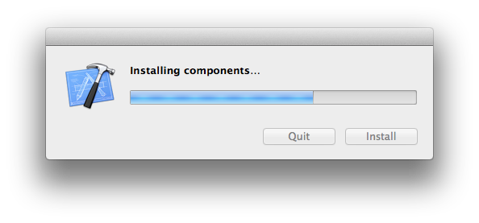

#A designer's guide to installing Jekyll
__by Tim Potter__

###Introduction

I'm a web designer and I've been using GitHub for a few months now. My mind was blown - I can host unlimited projects for free, collaborate with others and keep track of changes thanks to Git version control. I recently got to grips with setting up [GitHub Pages](https://pages.github.com/) for hosting websites, and it's bloody fantastic so I decided to level up and try [Jekyll](http://jekyllrb.com/) for all the extra goodies, but let me start this tutorial with a few home truths. I have literally only spent about 3 minutes of my life using the Terminal prior to my attempts to install Jekyll. My problem with Terminal is that I have literally no idea what is going on and how to fix things if they don't work as expected. 

A lot of tutorials I followed, adopted an "on a wing and a prayer" approach. Phrases like "hopefully", "if all goes well", "fingers-crossed" crept up and I failed every single time on the very first instruction:

	gem install jekyll

This step-by-step guide will take you through the process of installing Jekyll and the road blocks I had to navigate along the way, in the hope that it will help others quick-start their Jekyll install.

####Prerequisites 

+ For this tutorial you will need a Mac running OS X Mavericks

###01. Check your version of Ruby

The very first stage is to check to see what version of Ruby you have installed. To be honest I didn't really know what Ruby is, although I was aware of it from conversations with developers. A Google quick search brings up Wikipedia which tells me that "Ruby is a dynamic, reflective, object-oriented, general-purpose programming language." Alright, so it's a programming language, that makes sense. Let's check to see it's installed. Fire up the Terminal - if you don't know where it is, you can find it by using Spotlight.

	ruby --version

Great! I'm on Ruby version 2. Why is this great? Because you need to be on Ruby v1.9+ in order to install Jekyll according to the documentation. Ruby is typically installed as part of OS X, so an upgrade to Mavericks is certainly the one way on ticking off Jekyll's prerequisites.

###02. The fateful install command

Next, according to the [Jekyll quick start](http://jekyllrb.com/docs/quickstart/) is to type in the following command:

	gem install jekyll

You don't have permissions - WTF! 

###03. Super User - sudo command

Having chatted with a friend, he suggested adding the sudo command before the 'gem install jekyll' as this will give you [Super User](http://wiki.answers.com/Q/What_does_sudo_mean_in_Linux) access. 

	sudo gem install jekyll

You'll see it will now prompt you for your password. This is the same password you use to login to OS X.

Looks like things are beginning to happen, but something disrupted the install and we've encountered another error. Lets check the Jekyll documentation for a solution to "can't find header files for ruby"... several minutes later - nothing!

###04. Don't give up just yet - install XCode

Not as easy as the tutorials make it! I've been tripped up at the very first instruction and I need to figure out how to fix it. Google to the rescue. One of the first results I found was from the ever useful community over at Stack Overflow (how many times has that site saved your skin!) which suggested [installing XCode from the App Store](http://stackoverflow.com/questions/10725767/error-installing-jekyll-native-extension-build).

Click on the App Store, search for XCode and install it. You may as well go make a cup of tea at this stage as it's a big ol' download at over 2GB.

Once XCode is installed, open it and accept the terms and conditions and the installation will finalise.

###05. Let's try that again

If like me, you can now close XCode, never to be opened again. Now, let's go back to the terminal and try to install Jekyll again. Like before, let's use the super user command to get things going.

	sudo gem install jekyll

Well this is encouraging, Jekyll now appears to be installing. You'll probably spend several anxious minutes fixated on the screen waiting for another error message to appear, but things are looking good.

###06. Wait for it...

Hooray! Jekyll is installed. Now just to be sure let's check to see what version of Jekyll we are running by typing in the following command (we don't need sudo in this case as we're not attemping to change or install anything).

	jekyll --version

###07. Success :)

And there you have it, a designer's ~~guide~~ journey to installing Jekyll on OS X Mavericks. Now refer back to the [Jekyll documentation](http://jekyllrb.com/) to see all the fantastic things you can now do.

